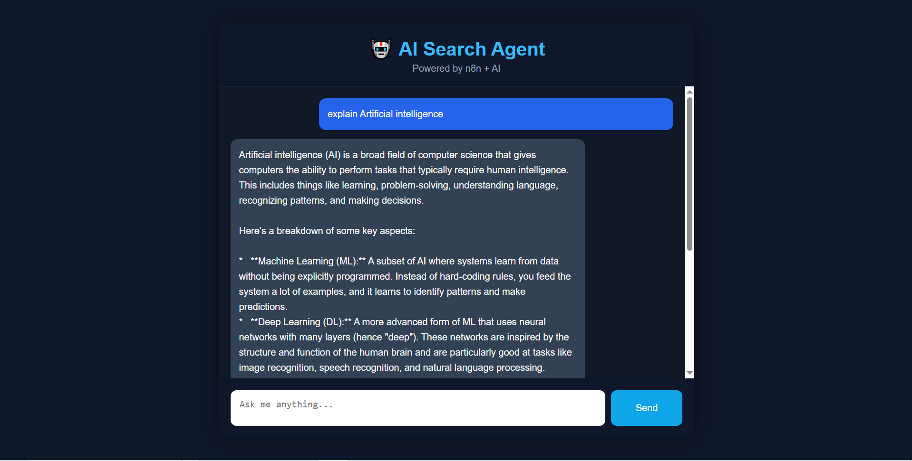
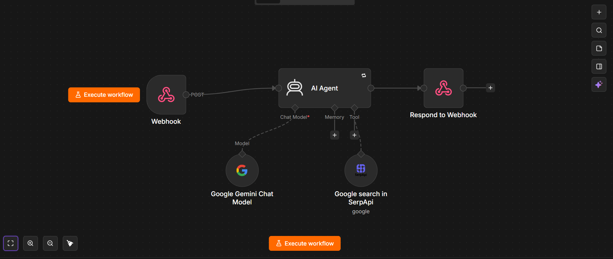

# 🤖 AI Search Agent

An AI-powered Search Agent that answers user queries in real time using a responsive web interface and an n8n Cloud workflow. The application communicates with an AI model through webhooks and is deployed on Vercel.

---

## 🌐 Live Demo

👉 https://ai-search-agent-wheat.vercel.app

---

## 📌 Features

- 🤖 AI-powered question answering
- 💬 Interactive chat interface
- ⚡ Real-time responses using n8n Cloud
- 🌐 Deployed on Vercel
- 📱 Responsive design
- ⌨️ Press Enter to send messages
- 🔄 Loading spinner while waiting for AI response
- 🎨 Modern and clean user interface

---

## 🛠️ Tech Stack

### Frontend
- HTML5
- CSS3
- JavaScript

### Backend Automation
- n8n Cloud
- Webhooks

### AI
- AI API integrated through n8n workflow

### Deployment
- Vercel

### Version Control
- Git
- GitHub

---

## 📂 Project Structure

```
AI-Search-Agent/
│
├── index.html
├── style.css
├── script.js
├── README.md
├── images/
└── workflow/
```

---

## 🚀 How to Run Locally

### Clone the repository

```bash
git clone https://github.com/pramodkumar0910/AI-Search-Agent.git
```

### Open the project

Open the project folder in VS Code.

### Run using Live Server

Right-click **index.html**

↓

Open with Live Server

---

## 💡 How It Works

1. User enters a question.
2. JavaScript sends the question to an n8n webhook.
3. The n8n workflow processes the request.
4. The AI generates a response.
5. The response is displayed in the chat interface.

---

## 📸 Screenshots

### Home Page


### AI Conversation



### n8n Workflow



---

## 🔮 Future Improvements

- Chat history
- Dark/Light mode
- Markdown support
- Code syntax highlighting
- Voice input
- AI typing animation
- File upload support
- Multiple AI model support

---

## 👨‍💻 Author

**Pramod Kumar Patnam**

- GitHub: https://github.com/pramodkumar0910
- LinkedIn: https://www.linkedin.com/in/pramod-kumar-patnam-9006b6320

---

## ⭐ Support

If you found this project useful, please consider giving it a ⭐ on GitHub.